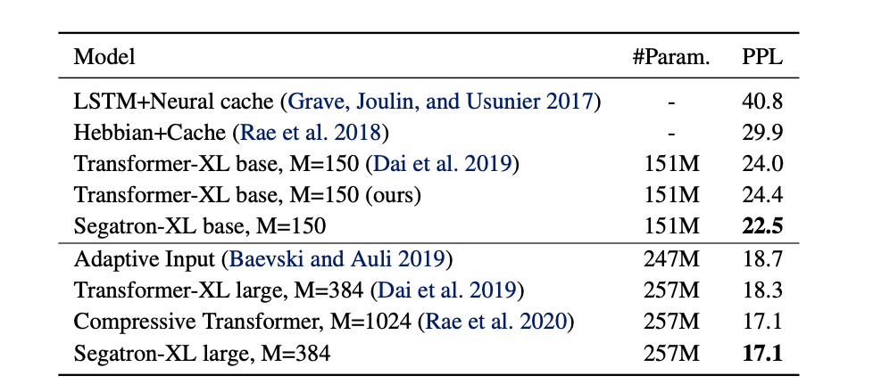
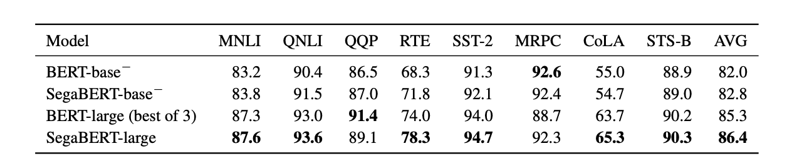
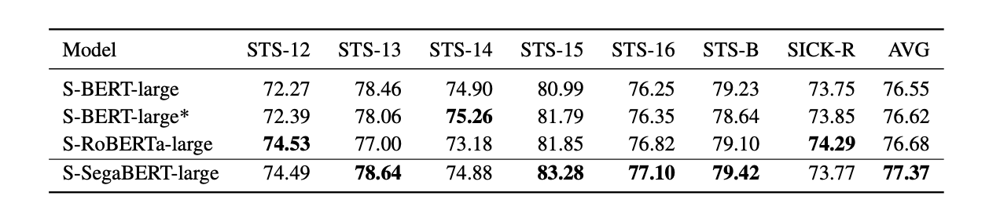

# Segatron
[](https://opensource.org/licenses/MIT)

This repo contains codes and pre-trained models for our paper 

> [Segatron: Segment-aware Transformer for Language Modeling and Understanding](https://arxiv.org/abs/2004.14996)
>
> He Bai, Peng Shi, Jimmy Lin, Yuqing Xie, Luchen Tan, Kun Xiong, Wen Gao, Ming Li
>
> AAAI 2021

## Setup

To use this repo, please install NVIDIA APEX. We recommand using this [docker](https://github.com/richardbaihe/pytorch_docker) or building your own environment with NGC's PyTorch container `nvcr.io/nvidia/pytorch:20.03-py3`. 

## Download Checkpoints

We have uploaded following checkpoints to the huggingace models:

- [bert-base-500k](https://huggingface.co/rsvp-AI-ca/bert-uncased-base-50k)
- [segabert-base-500k](https://huggingface.co/rsvp-AI-ca/segabert-uncased-base-50k)
- [segabert-large](https://huggingface.co/rsvp-AI-ca/segabert-large)
- [sentence-segabert-large](https://huggingface.co/rsvp-AI-ca/sentence-segabert-large)
- [segatron-xl-base](https://huggingface.co/rsvp-AI-ca/segatransformer-xl-base)
- [segatron-xl-large](https://huggingface.co/rsvp-AI-ca/segatransformer-xl-large)


## Pre-training
- The source code is in the `segabert` folder, which is based on [Megatron-LM](https://github.com/NVIDIA/Megatron-LM/tree/master)'s repository.

- Please refer to [segabert/README.md](segabert/README.md) for details.

## Evaluation

### 1. Wikitext-103

- The source code is in the `segatron-xl` folder, which is based on [Transformer-xl](https://github.com/kimiyoung/transformer-xl)'s repository.

- Please refer to [segatron-xl/README.md](segatron-xl/README.md) for details.



### 2. GLUE and Machine Reading Comprehension

- The source code is in the `transformers` folder, which is based on huggingface's [Transformers](https://github.com/huggingface/transformers) repository. It should be notice that Segatron needs paragraph position index, sentence position index, and token position index in its input features. Hence we changed the input feature extraction and model forward functions of Transformers, which means our codes is not compatiable with the huggingface's Transformers.

- Please refer to [transformers/README.md](transformers/README.md) for details.



### 3. SST

- The source code is in the `sentence-transformers` folder, which is based on [Sentence-Transformer](https://github.com/UKPLab/sentence-transformers)'s repository.
- Please refer to [sentence-transformers/README.md](sentence-transformers/README.md) for details.



## Citation

Please cite [the AAAI 2021 paper]((https://arxiv.org/abs/2004.14996)):

```tex
@article{bai2020segabert,
  title={Segatron: Segment-Aware Transformer for Language Modeling and Understanding},
  author={Bai, He and Shi, Peng and Lin, Jimmy and Yuqing Xie, and Tan, Luchen and Xiong, Kun and Gao, Wen and Li, Ming},
  journal={arXiv preprint arXiv:2004.14996},
  year={2020}
}
```

